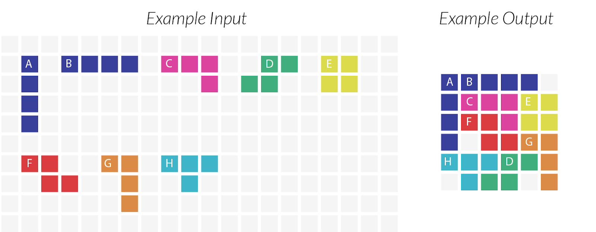

# fillit

The fillit project allow us to familiarize ourself with a recurrent problematic in programming : the search for an optimal solution among a very large number of possibilities, in a reasonable time.

The problem is easy to explain but harder to solve. Given a set of Tetrominoes, we need to find a way to assemble them in the smallest possible square.

For this project we implemented a resursive [backtracking algorithm](https://en.wikipedia.org/wiki/Backtracking).

---

Credit to [Beth Locke](https://medium.com/@bethnenniger) for the picture.
